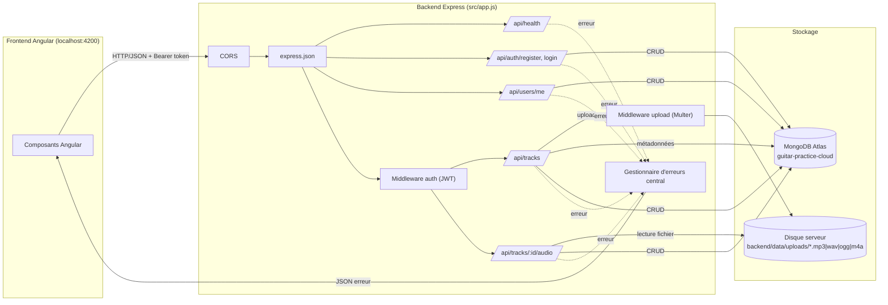
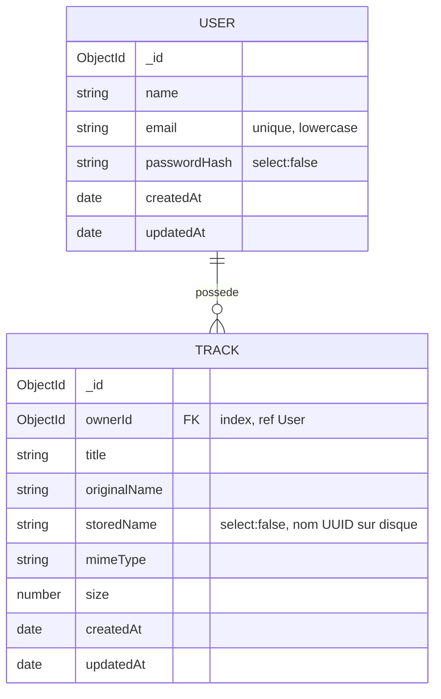
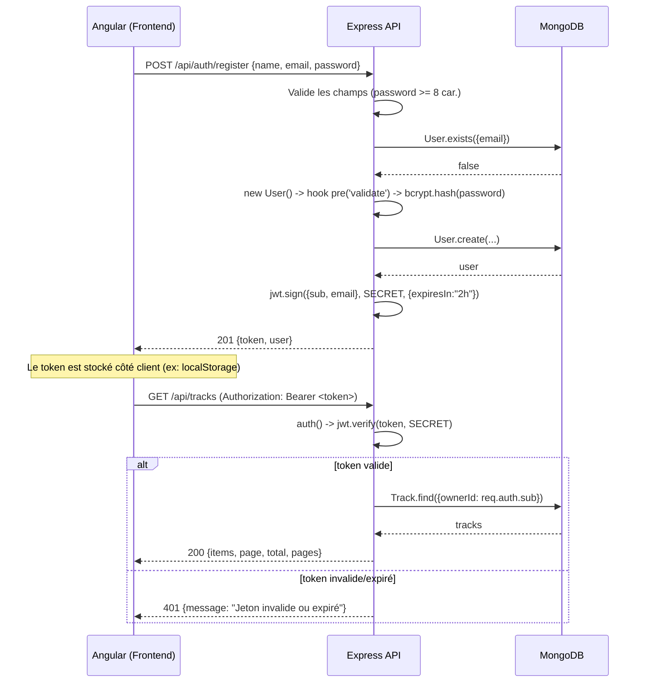
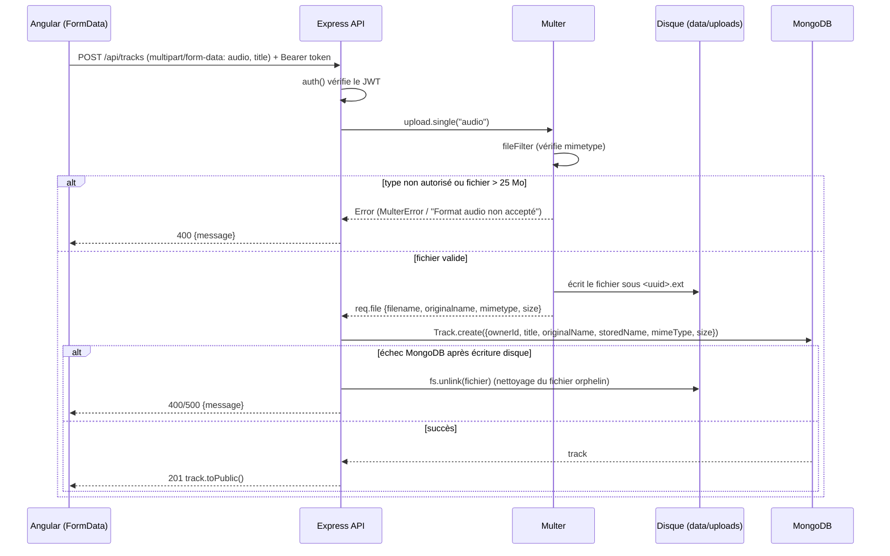
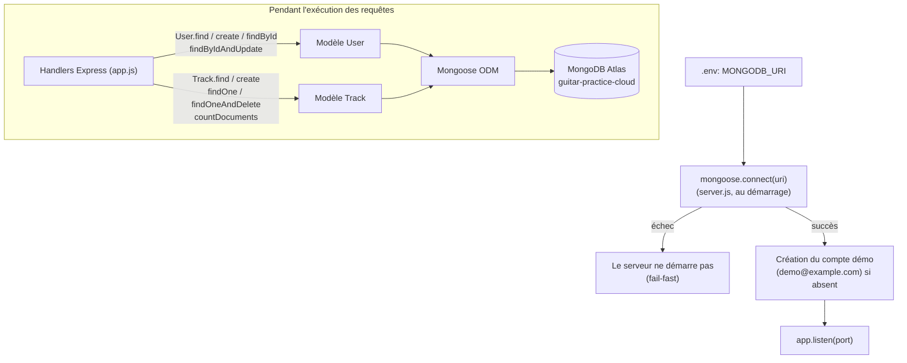

# Analyse du backend — Guitar Practice Cloud API

Ce document décrit l'architecture, les workflows, les technologies et les mécanismes clés (authentification, upload de fichiers, accès base de données) du backend situé dans `backend/`.

## 1. Vue d'ensemble

Le backend est une API REST **Node.js / Express** nommée `gpc-api` (v3.0.0), servant de support à une application de gestion de pistes audio ("Guitar Practice Cloud"). Elle permet à un utilisateur de :

- créer un compte et se connecter (authentification par JWT) ;
- consulter/modifier son profil ;
- uploader des fichiers audio (mp3, wav, ogg, m4a) ;
- lister, écouter et supprimer ses propres pistes.

Les fichiers audio sont stockés **sur le disque du serveur**, tandis que **MongoDB** ne conserve que leurs métadonnées (titre, nom, taille, type MIME, propriétaire...).

## 2. Stack technique

| Domaine | Technologie | Rôle |
|---|---|---|
| Serveur HTTP | **Express 5** | Routage, middlewares, gestion des requêtes/réponses |
| Base de données | **MongoDB** (Atlas) via **Mongoose 9** | Persistance des utilisateurs et métadonnées des pistes |
| Authentification | **jsonwebtoken (JWT)** + **bcryptjs** | Génération/vérification de tokens, hachage des mots de passe |
| Upload de fichiers | **multer** (diskStorage) | Réception et écriture des fichiers audio sur disque |
| CORS | **cors** | Autorise les appels cross-origin depuis le frontend Angular (localhost:4200) |
| Tests | `node:test` (natif) + `fetch` | Tests d'intégration légers sur l'API |
| Config | fichier `.env` (`MONGODB_URI`, `JWT_SECRET`, `PORT`) | Paramètres d'environnement, jamais exposés au frontend |

Le projet utilise les modules ES (`"type": "module"` dans `package.json`).

## 3. Structure du projet

```
backend/
├── src/
│   ├── app.js              # Construction de l'application Express (routes, middlewares)
│   ├── server.js           # Point d'entrée : connexion Mongo + démarrage du serveur HTTP
│   └── models/
│       ├── User.js         # Schéma Mongoose "User" (auth, hachage mdp)
│       └── Track.js        # Schéma Mongoose "Track" (métadonnées audio)
├── data/uploads/           # Fichiers audio stockés physiquement (nommés en UUID)
├── test/api.test.js        # Tests d'intégration (health check, schémas)
├── .env / .env.example     # Variables d'environnement
└── package.json
```

**Séparation `app.js` / `server.js`** : `createApp()` construit l'application Express sans ouvrir de port, ce qui permet aux tests de l'utiliser directement (via `supertest`-like `fetch` sur un serveur éphémère) sans dépendre de Mongo ni d'un port fixe. `server.js` est le seul fichier qui se connecte à MongoDB et appelle `.listen()`.

## 4. Architecture globale



Points clés :
- Toutes les requêtes JSON passent par `express.json()`.
- Les routes `/api/users/me` et `/api/tracks*` sont protégées par le middleware `auth` (vérification du JWT).
- L'upload combine `auth` (identifier l'utilisateur) **puis** `upload.single("audio")` (Multer) avant le handler de route.
- Un middleware d'erreur central traduit les erreurs connues (Multer, validation Mongoose, CastError) en réponses HTTP appropriées.

## 5. Modèle de données (MongoDB / Mongoose)



- **User** (`src/models/User.js`) : le mot de passe n'est jamais stocké en clair. Un champ *virtual* `password` reçoit temporairement la valeur en mémoire ; un hook Mongoose `pre('validate')` le hache avec `bcrypt.hash(..., 10)` avant sauvegarde. `passwordHash` a `select: false` (jamais renvoyé par défaut). `toPublic()` expose uniquement `id`, `name`, `email`, `createdAt`.
- **Track** (`src/models/Track.js`) : relation `ownerId → User` (ObjectId indexé). `storedName` (nom UUID du fichier sur disque) a aussi `select: false` pour ne jamais fuiter le chemin de stockage réel côté client. Un index composé `{ ownerId: 1, createdAt: -1 }` optimise la pagination des pistes d'un utilisateur triées par date.

## 6. Authentification (JWT)

### Principe

- Inscription/connexion → génération d'un **JWT** signé (HS256 implicite via `jsonwebtoken`) contenant `{ sub: userId, email }`, valide **2h**.
- Le secret de signature (`JWT_SECRET`) reste côté serveur (`.env`), jamais transmis à Angular.
- Chaque requête protégée doit inclure l'en-tête `Authorization: Bearer <token>`.
- Le middleware `auth()` vérifie la signature/expiration via `jwt.verify` et injecte `req.auth = { sub, email }` pour les handlers suivants.

### Séquence : inscription puis appel à une route protégée



### Sécurité

- Mots de passe jamais loggés ni renvoyés (hash uniquement, `select:false`).
- `login` sélectionne explicitement `+passwordHash` pour la comparaison via `bcrypt.compare`.
- Toutes les routes de données (`/api/users/me`, `/api/tracks*`) filtrent systématiquement par `ownerId: req.auth.sub` → isolation stricte des données entre utilisateurs.

## 7. Upload de fichiers (Multer)

### Configuration

- **Stockage disque** (`multer.diskStorage`) : destination fixe `backend/data/uploads/`, créée au démarrage (`fs.mkdirSync(..., {recursive:true})`).
- **Nom de fichier** : `crypto.randomUUID() + extension` → évite collisions et n'expose pas le nom original côté disque.
- **Limites** : taille max **25 Mo** (`limits.fileSize`).
- **Filtrage MIME** (`fileFilter`) : seuls `audio/mpeg`, `audio/wav`, `audio/x-wav`, `audio/ogg`, `audio/mp4`, `audio/x-m4a` sont acceptés ; sinon une erreur est renvoyée avant écriture sur disque.

### Séquence : upload d'une piste



### Lecture et suppression

- `GET /api/tracks/:id/audio` : recherche la piste **filtrée par `ownerId`** (empêche d'accéder au fichier d'un autre utilisateur même en devinant l'ID), récupère `storedName` (normalement caché), puis sert le fichier via `res.sendFile()` avec le bon `Content-Type` (`res.type(track.mimeType)`).
- `DELETE /api/tracks/:id` : supprime le document Mongo (`findOneAndDelete`, filtré par `ownerId`) **et** le fichier physique correspondant (`fs.unlink`). Si la suppression du fichier échoue, l'API renvoie un 500 explicite plutôt que de masquer l'incohérence (métadonnée supprimée mais fichier restant).

## 8. Accès à la base de données (Mongoose / MongoDB Atlas)



- **Connexion** : `server.js` établit la connexion Mongoose **avant** de démarrer le serveur HTTP (`await mongoose.connect(uri)`), garantissant que l'API ne répond jamais sans base disponible (fail-fast : une erreur de connexion stoppe le process).
- **Seed** : à chaque démarrage, un compte de démonstration (`demo@example.com` / `Demo1234!`) est créé s'il n'existe pas encore, pour faciliter les tests manuels.
- **Requêtes** : chaque route utilise directement les modèles Mongoose (`User`, `Track`) — pas de couche repository/service intermédiaire, l'accès BDD est fait directement dans les handlers Express.
- **Optimisations notables** :
  - `Promise.all` pour paralléliser `Track.find()` et `Track.countDocuments()` lors de la pagination.
  - `.lean()` sur les lectures de liste pour de meilleures performances (retourne des objets JS bruts plutôt que des documents Mongoose).
  - `.select("+champ")` / `select:false` pour contrôler finement l'exposition des champs sensibles (`passwordHash`, `storedName`).
  - Index Mongo dédiés (`ownerId`, `{ownerId, createdAt}`) pour accélérer les requêtes filtrées/triées par utilisateur.

## 9. API — récapitulatif des endpoints

| Méthode | Route | Auth | Description |
|---|---|:---:|---|
| GET | `/api/health` | non | Vérifie que l'API répond |
| POST | `/api/auth/register` | non | Crée un compte, retourne `{token, user}` |
| POST | `/api/auth/login` | non | Authentifie, retourne `{token, user}` |
| GET | `/api/users/me` | oui | Profil de l'utilisateur connecté |
| PUT | `/api/users/me` | oui | Met à jour le nom de l'utilisateur |
| GET | `/api/tracks` | oui | Liste paginée des pistes de l'utilisateur (`page`, `limit`) |
| POST | `/api/tracks` | oui | Upload d'un fichier audio + métadonnées (`multipart/form-data`) |
| GET | `/api/tracks/:id/audio` | oui | Stream/téléchargement du fichier audio |
| DELETE | `/api/tracks/:id` | oui | Supprime la piste (métadonnée + fichier) |

## 10. Gestion des erreurs

Un middleware d'erreur central (fin de `createApp()`) intercepte toutes les erreurs transmises via `next(error)` :

- `multer.MulterError` ou message `"Format audio non accepté"` → **400**
- `ValidationError` (Mongoose) → **400**
- `CastError` (ex : ID MongoDB mal formé) → **404**
- Autres erreurs → propagées au gestionnaire par défaut d'Express

Chaque route logue systématiquement ses erreurs (`console.error`) sans jamais loguer de mot de passe ou de token brut.

## 11. Tests

`test/api.test.js` utilise le test runner natif de Node (`node:test`) :
- démarre `createApp()` sur un port éphémère (0) sans dépendre de MongoDB pour le test `/api/health` ;
- teste la construction des schémas Mongoose (normalisation de l'email en minuscules, relation `ownerId → User`) sans connexion réelle à la base.

## 12. Critiques et axes d'amélioration (par ordre de priorité)

Les points ci-dessous sont classés du plus critique au moins critique, avec un focus particulier sur la sécurité comme demandé. Chaque point liste le **constat**, le **risque**, et une **amélioration proposée**.

### 1. Secret JWT avec valeur par défaut codée en dur — 🔴 Critique

- **Constat** : `const SECRET = process.env.JWT_SECRET || "tp1-development-secret";` (`app.js:27`). Si `.env` est absent ou mal chargé, le serveur démarre quand même avec un secret **public** (visible dans le code source, donc dans tout dépôt Git).
- **Risque** : n'importe qui connaissant cette valeur par défaut peut forger un JWT valide pour **n'importe quel utilisateur** (`jwt.sign({sub: "<id arbitraire>"}, "tp1-development-secret")`) et usurper son identité sans connaître son mot de passe.
- **Amélioration proposée** : appliquer le même principe de *fail-fast* que pour `MONGODB_URI` dans `server.js` : si `JWT_SECRET` est absent, lever une erreur et refuser de démarrer, plutôt que de retomber sur une valeur par défaut.

### 2. Validation du fichier uploadé basée uniquement sur le type MIME déclaré par le client — 🔴 Critique

- **Constat** : `fileFilter` (`app.js:109-119`) ne vérifie que `file.mimetype`, une valeur **entièrement contrôlée par le client** (l'en-tête `Content-Type` du champ multipart), et non le contenu réel du fichier.
- **Risque** : un attaquant peut envoyer n'importe quel contenu (script, exécutable, fichier arbitraire) en déclarant un `mimetype` autorisé (ex. `audio/mpeg`) avec une extension `.mp3` de complaisance. Le fichier est alors stocké et redistribué depuis le serveur comme s'il s'agissait d'un fichier audio légitime.
- **Amélioration proposée** : après écriture du fichier, vérifier sa signature binaire réelle (« magic bytes », via une librairie comme `file-type`) et rejeter/supprimer le fichier si le type détecté ne correspond pas au type déclaré ni à la liste blanche autorisée.

### 3. Absence de limitation des tentatives de connexion (brute-force) — 🔴 Critique

- **Constat** : `POST /api/auth/login` n'a aucune limite de fréquence ni de verrouillage de compte après plusieurs échecs.
- **Risque** : attaque par force brute ou *credential stuffing* possible sans contrainte, à l'échelle du script (aucun ralentissement, aucun CAPTCHA, aucun blocage IP/compte).
- **Amélioration proposée** : ajouter un middleware de rate-limiting (ex. `express-rate-limit`) sur `/api/auth/login` et `/api/auth/register`, avec un verrouillage temporaire progressif après N échecs consécutifs pour un même email/IP.

### 4. Configuration CORS totalement permissive — 🟠 Important

- **Constat** : `app.use(cors())` (`app.js:145`) sans restriction, autorise **n'importe quelle origine** à appeler l'API.
- **Risque** : élargit inutilement la surface d'attaque — un site malveillant peut effectuer des appels directs à l'API depuis le navigateur d'une victime (par exemple pour du scan/énumération), et un token JWT dérobé via une faille XSS ailleurs pourrait être rejoué depuis n'importe quel domaine.
- **Amélioration proposée** : restreindre `origin` à la liste des URLs connues du frontend via une variable d'environnement (`cors({ origin: process.env.FRONTEND_URL })`), plutôt que d'autoriser `*` implicitement.

### 5. Aucune invalidation/révocation possible des JWT émis — 🟠 Important

- **Constat** : un JWT signé reste valide jusqu'à son expiration naturelle (2h), quoi qu'il arrive côté serveur (changement de mot de passe, compromission détectée, etc.).
- **Risque** : en cas de vol de token, l'attaquant conserve un accès valide jusqu'à 2h, sans qu'aucune action côté serveur ne puisse le couper.
- **Amélioration proposée** : ajouter un champ `tokenVersion` sur `User`, l'inclure dans le payload du JWT, et l'incrémenter à chaque changement de mot de passe ; le middleware `auth` rejette alors tout token dont la version ne correspond plus à celle en base. Alternative plus lourde : liste de révocation (Redis) ou tokens de courte durée + refresh token.

### 6. Compte de démonstration créé automatiquement sans garde-fou d'environnement — 🟠 Important

- **Constat** : `server.js:31-49` crée systématiquement `demo@example.com` / `Demo1234!` au démarrage si le compte n'existe pas, sans condition sur l'environnement (dev/prod).
- **Risque** : si ce code venait à tourner contre une base de données réellement exposée (déploiement de démonstration public, erreur de configuration), un compte avec des identifiants **publiquement connus** (ils figurent dans ce code) serait automatiquement provisionné.
- **Amélioration proposée** : conditionner ce seed à une variable explicite (ex. `if (process.env.SEED_DEMO_USER === "true")`), désactivée par défaut, et documenter que cette variable ne doit être activée qu'en environnement de développement/démo interne.

### 7. Fuite potentielle de traces techniques via le gestionnaire d'erreur par défaut d'Express — 🟡 Modéré

- **Constat** : le middleware d'erreur central (`app.js:442-459`) ne traite explicitement que 3 catégories d'erreurs ; toute autre erreur est passée à `next(error)` et retombe sur le gestionnaire par défaut d'Express, qui peut renvoyer la **stack trace** au client si `NODE_ENV` n'est pas positionné à `production`. Or `NODE_ENV` n'est fixé nulle part dans le projet (`package.json`, `.env.example`).
- **Risque** : divulgation d'informations internes (chemins de fichiers, structure du code, versions de dépendances) utile à un attaquant en reconnaissance.
- **Amélioration proposée** : ajouter un handler final systématique qui renvoie toujours une réponse JSON générique (`500 { message: "Erreur interne" }`) sans jamais exposer la stack trace au client, tout en la gardant dans les logs serveur.

### 8. Absence d'en-têtes de sécurité HTTP (pas de `helmet`) — 🟡 Modéré

- **Constat** : aucun middleware ne définit des en-têtes de sécurité standards (`X-Content-Type-Options`, `X-Frame-Options`, `Strict-Transport-Security`, `Content-Security-Policy`, etc.).
- **Risque** : expose l'API à des classes d'attaques que ces en-têtes limitent habituellement (MIME-sniffing, clickjacking sur d'éventuelles pages servies, etc.).
- **Amélioration proposée** : ajouter le middleware `helmet` (`app.use(helmet())`), une ligne suffit pour un gain de sécurité notable.

### 9. Politique de mot de passe faible et énumération d'emails possible à l'inscription — 🟡 Modéré

- **Constat** : le seul critère de robustesse du mot de passe est une longueur ≥ 8 caractères (`app.js:169`), sans exigence de complexité. Par ailleurs, `POST /api/auth/register` renvoie explicitement `409 "Email déjà utilisé"` (`app.js:179`) quand l'email existe déjà.
- **Risque** : mots de passe faibles plus faciles à casser hors ligne en cas de fuite de la base ; le message d'erreur distinct sur l'email permet à un attaquant de vérifier si une adresse email donnée possède un compte sur le service (énumération de comptes).
- **Amélioration proposée** : renforcer la politique de mot de passe (regex minimale : majuscule/minuscule/chiffre, ou intégrer `zxcvbn`) ; envisager un message de réponse plus neutre pour l'inscription, ou a minima être conscient de ce compromis UX/sécurité.

### 10. Absence de couche de validation structurée des entrées — 🟢 Mineur

- **Constat** : la validation des corps de requête est faite « à la main », de façon ad hoc et incomplète dans chaque route (pas de vérification de format d'email, pas de limite de longueur sur `name`/`title`, pas de schéma centralisé).
- **Risque** : incohérences entre routes, oublis faciles lors de futures évolutions, messages d'erreur peu homogènes ; risque modéré de données invalides ou disproportionnées stockées en base.
- **Amélioration proposée** : introduire une librairie de validation de schéma (ex. `zod` ou `joi`) appliquée en middleware sur chaque route, centralisant les règles (format email, longueur des champs, types attendus) et rejetant les requêtes non conformes de façon uniforme.

---

**Autres limites déjà connues du contexte pédagogique** (moins prioritaires, hors sécurité) :
- Stockage des fichiers **local au disque du serveur** (pas de bucket externe type S3), peu adapté à un déploiement multi-instances/scalable.
- Pas de rafraîchissement de token : le JWT expire après 2h sans mécanisme de renouvellement, obligeant l'utilisateur à se reconnecter.

---

# Mission 1 TD 1

## Formulaires de connexion et d'inscription (frontend Angular)

### Constat initial

Les formulaires de connexion (`frontend-starter/src/app/components/login-page/`) et d'inscription (`frontend-starter/src/app/components/register-page/`) utilisaient déjà les **formulaires réactifs** d'Angular (`FormGroup`, `FormControl`, `ReactiveFormsModule`). En revanche, les validateurs déclarés n'étaient pas exploités :

- `submit()` envoyait la requête même quand le formulaire était invalide, ce qui provoquait un aller-retour inutile vers le serveur et une erreur 400.
- Aucun message n'était affiché sous les champs, donc l'utilisateur ne savait pas quoi corriger.
- Rien n'empêchait un double clic : on pouvait envoyer deux fois la même inscription ou connexion.
- Le front ne vérifiait pas la règle du backend (`app.js:169`), qui refuse les mots de passe de moins de 8 caractères.
- L'inscription ne demandait pas de confirmer le mot de passe.

### Ce qui a été fait

**Inscription (`register-page.ts` / `register-page.html`)**
- Validateurs `minLength(2)` sur le nom et `minLength(8)` sur le mot de passe, pour appliquer la même règle que le backend.
- Nouveau champ `confirmPassword`, avec un validateur de groupe (`passwordsMatch`) qui vérifie que les deux mots de passe sont identiques.
- Méthode `hasError(champ, erreur)` : elle affiche le message d'un champ seulement quand ce champ a été touché (`touched`).
- Messages d'erreur sous chaque champ, avec un compteur de caractères pour le mot de passe.
- Message dédié en cas d'erreur 409 : « Un compte existe déjà avec cet email ».

**Connexion (`login-page.ts` / `login-page.html`)**
- Même méthode `hasError` et messages sous les champs.
- Message dédié en cas d'erreur 401 : « Email ou mot de passe incorrect ».
- Les identifiants de démo préremplis sont conservés pour les tests. Ils doivent être retirés avant le rendu.

**Commun aux deux formulaires**
- Au début de `submit()`, si le formulaire est invalide, `markAllAsTouched()` affiche toutes les erreurs et rien n'est envoyé.
- Un signal `loading` désactive le bouton pendant la requête et change son libellé (« Connexion… », « Création… »). `finalize()` le remet à `false`, que la requête réussisse ou échoue.
- L'email est nettoyé avec `trim()` puis `toLowerCase()` avant l'envoi.
- Attributs `autocomplete` (`email`, `current-password`, `new-password`), `aria-invalid` sur les champs et `role="alert"` sur le message d'erreur global.
- `novalidate` sur le `<form>` : la validation native du navigateur ne vient plus doubler celle d'Angular.

**Styles (`src/styles.css`)**
- `input.ng-invalid.ng-touched` : bordure rouge sur les champs invalides.
- `small.error` : mise en page des messages sous les champs.

La compilation a été vérifiée avec `ng build`, sans erreur.

### Tableau des changements et apports pour l'utilisateur

| Changement | Effet pour l'utilisateur |
|---|---|
| Messages sous chaque champ, affichés après `touched` | Il sait tout de suite ce qu'il doit corriger, sans voir d'erreur avant même d'avoir tapé. |
| Blocage de l'envoi si le formulaire est invalide, avec `markAllAsTouched()` | Pas d'attente d'une réponse du serveur : toutes les erreurs apparaissent d'un coup. |
| `minLength(8)` identique au backend | Plus d'erreur 400 incompréhensible : la règle est expliquée avant l'envoi, avec un compteur. |
| Confirmation du mot de passe (validateur sur le groupe) | Évite de créer un compte avec un mot de passe mal tapé, donc impossible à retrouver. |
| Signal `loading` et bouton désactivé | Pas de double envoi, et l'utilisateur voit que sa demande est en cours. |
| Messages adaptés aux codes 409 et 401 | « Email déjà utilisé » ou « identifiants incorrects » au lieu d'une erreur générique. |
| `trim()` et `toLowerCase()` sur l'email | Un espace en trop ou une majuscule ne fait plus échouer la connexion. |
| `autocomplete`, `aria-invalid`, `role="alert"` | Le gestionnaire de mots de passe peut remplir les champs et en proposer un, et un lecteur d'écran annonce les erreurs. |

## Mission 1 — Partie Inscription

### Existant vérifié avant modification

- **Signals** : l'état partagé est dans `AuthService` (`currentUser`, `token`). L'état propre à une page (`error`, `loading`) reste dans le composant.
- **Service API** : `AuthService.register()` appelle `POST /api/auth/register`. Dans son `tap()`, `storeAuthentication()` enregistre le token dans `localStorage` (clé `gpc_token`) et met à jour les deux signals. Le service n'a donc pas eu besoin d'être modifié pour l'inscription.
- **Routing** : `/register` est une route publique. Après l'inscription, on est redirigé vers `/profile`, qui est protégée par `authGuard`. Le guard laisse passer puisque le token vient d'être enregistré.
- **Backend** (`app.js:164-190`) :
  - `400` si le nom, l'email ou le mot de passe manque, ou si le mot de passe fait moins de 8 caractères ;
  - `409` si l'email est déjà utilisé ;
  - `201 { token, user }` en cas de succès.

  Le schéma Mongoose nettoie aussi le nom (`trim`) et exige au moins 2 caractères.

### Fichiers modifiés

- `frontend-starter/src/app/components/register-page/register-page.ts`
- `frontend-starter/src/app/components/register-page/register-page.html`

### Ajouts et modifications

- **Validateur `notBlank`** : un nom comme `"   "` passait la validation Angular (`required`, `minLength`), mais le backend le refusait après son `trim`. Il est maintenant refusé dès le formulaire.
- **Erreurs typées avec `HttpErrorResponse`**, traduites en message lisible par une méthode `errorMessage()` selon le statut HTTP.
- **Email déjà utilisé (409)** : en plus du message global, le champ email passe en erreur (`emailTaken`) et affiche un lien « se connecter ? ». L'erreur disparaît dès que l'email est modifié, car les validateurs sont relancés.
- **Logs plus sûrs** : seul le statut HTTP est logué. Auparavant, tout l'objet d'erreur partait dans la console. Ni le mot de passe ni le token n'apparaissent dans les logs.

### Flux d'inscription

1. L'utilisateur saisit le nom, l'email, le mot de passe et sa confirmation. Les erreurs s'affichent sous un champ une fois qu'il l'a quitté.
2. Au clic sur « Créer mon compte » :
   - si le formulaire est invalide, `markAllAsTouched()` affiche toutes les erreurs et rien n'est envoyé ;
   - sinon, `loading` passe à `true` et le bouton est désactivé avec le libellé « Création… ».
3. `AuthService.register(nom nettoyé, email nettoyé et en minuscules, mot de passe)` envoie `POST /api/auth/register` avec `{ name, email, password }`. La confirmation du mot de passe n'est pas envoyée.
4. Si l'API répond `201`, `storeAuthentication()` enregistre le token dans `localStorage`, met à jour `token()` et `currentUser()`, puis le composant redirige vers `/profile`.
5. En cas d'erreur, un message s'affiche avec `role="alert"`.
6. Dans les deux cas, `finalize()` remet `loading` à `false`.

### Cas d'erreur pris en charge

| Cas | Ce que voit l'utilisateur |
|---|---|
| Nom vide, composé seulement d'espaces, ou de moins de 2 caractères | Message sous le champ, rien n'est envoyé |
| Email vide ou mal formé | Message sous le champ |
| Mot de passe vide ou de moins de 8 caractères | Message sous le champ, avec un compteur (par exemple 5/8) |
| Les deux mots de passe sont différents | « Les mots de passe ne correspondent pas. » |
| **0** : backend éteint ou réseau coupé | « Serveur injoignable… » |
| **400** : données refusées par l'API | Le message renvoyé par l'API, ou un message générique |
| **409** : email déjà utilisé | Message global, plus une erreur sur le champ email avec un lien vers la connexion |
| Autre statut (500…) ou réponse inattendue | « Erreur inattendue pendant l'inscription… » |
| Double clic | Bouton désactivé pendant la requête |

## Mission 1 — Partie Connexion

### Existant vérifié avant modification

- **Backend** (`app.js:195-220`) : `200 { token, user }` si la connexion réussit, `401 "Identifiants incorrects"` si l'email est inconnu, si le mot de passe est faux ou si un champ manque. Toute autre erreur donne un `500`.
- **`AuthService.login()`** passe par la même fonction `storeAuthentication()` que l'inscription. Elle a été réutilisée, sans créer de doublon.
- **Réponse inattendue** : ce cas doit être géré dans le service et non dans le composant. `tap()` enregistre le token avant même que le composant reçoive la réponse : un `200` sans token ferait écrire `"undefined"` dans `localStorage` sans que le composant puisse l'empêcher.

### Fichiers modifiés

- `frontend-starter/src/app/components/login-page/login-page.ts`
- `frontend-starter/src/app/shared/services/auth.service.ts`

Le template `login-page.html` n'a pas changé : il contenait déjà les messages sous les champs, l'état `loading` et `role="alert"`.

### Ajouts et modifications

- **`auth.service.ts`** : `storeAuthentication()` lève une erreur si la réponse ne contient pas de token (chaîne non vide) ou pas de `user`. Rien n'est alors écrit dans `localStorage` ni dans les signals. L'inscription profite aussi de cette protection, puisqu'elle passe par la même fonction.
- **`login-page.ts`** :
  - méthode `errorMessage()`, construite comme celle de l'inscription, qui traduit chaque statut (0, 400, 401, 500 ou plus, autre) en message lisible, avec un cas à part pour une réponse inattendue qui n'est pas une `HttpErrorResponse` ;
  - seul le statut HTTP est logué, jamais le mot de passe ni le token ;
  - le champ mot de passe est vidé après un `401` ;
  - les identifiants de démo préremplis (`demo@example.com` / `Demo1234!`) sont retirés, car `best-practices.md` interdit de mettre un mot de passe dans le code Angular.

### Flux complet : formulaire → validation → API → JWT → currentUser → redirection

1. **Formulaire** : un `FormGroup` réactif avec `email` et `password`, vides au départ.
2. **Validation** :
   - l'email est `required` et doit avoir un format valide ; le mot de passe est `required` ;
   - un message s'affiche sous un champ une fois qu'on l'a quitté (`hasError` vérifie `touched`) ;
   - au clic, si le formulaire est invalide, `markAllAsTouched()` affiche toutes les erreurs et aucune requête ne part ;
   - si le formulaire est valide, `loading` passe à `true` et le bouton est désactivé.
3. **API** :
   - le composant appelle `AuthService.login(email nettoyé et en minuscules, mot de passe)`. Il n'utilise jamais `HttpClient` directement ;
   - le service envoie `POST /api/auth/login` avec `{ email, password }`, et le proxy transmet la requête à `localhost:3000` ;
   - l'intercepteur n'ajoute pas d'en-tête `Authorization`, puisqu'il n'y a pas encore de token.
4. **JWT** :
   - dans `tap()`, `storeAuthentication(response)` vérifie d'abord que la réponse est complète ;
   - si elle l'est, le token est écrit dans `localStorage['gpc_token']` et le signal `token` est mis à jour ;
   - le token n'est jamais logué.
5. **currentUser** : `currentUser.set(response.user)`. Tout composant qui lit `auth.currentUser()` se met à jour automatiquement.
6. **Redirection** :
   - `router.navigateByUrl('/tracks')` ;
   - `authGuard` voit `auth.token()` non vide et laisse passer ;
   - les requêtes suivantes reçoivent `Authorization: Bearer …` grâce à l'intercepteur ;
   - `finalize()` remet `loading` à `false`, que la requête réussisse ou échoue.

### Cas d'erreur pris en charge

| Cas | Où c'est détecté | Ce que voit l'utilisateur |
|---|---|---|
| Champs manquants ou email mal formé | Validation Angular, rien n'est envoyé | Message sous le champ concerné |
| **Identifiants incorrects (401)** | API | « Email ou mot de passe incorrect. » Le champ mot de passe est vidé. |
| Champs manquants côté API (400) | API, si la validation Angular est contournée | « Veuillez renseigner votre email et votre mot de passe. » |
| **Erreur serveur (500 ou plus)** | API | « Erreur du serveur. Réessayez dans quelques instants. » |
| Backend éteint ou réseau coupé (statut 0) | `HttpClient` | « Serveur injoignable… » |
| **Réponse inattendue** (200 sans token ni `user`) | `storeAuthentication()` lève une erreur avant d'écrire quoi que ce soit | « Réponse inattendue du serveur… » Rien n'est enregistré. |
| Double clic | Signal `loading` | Bouton désactivé |

### Vérification

- `ng build` passe sans erreur.
- **Tests prévus pour le checkpoint Network** :
  - une connexion réussie : statut 200 ;
  - un mauvais mot de passe : statut 401, le message reste affiché sur la page ;
  - dans la console : seuls « Connexion réussie » ou le statut HTTP apparaissent, jamais de token ni de mot de passe.

## Mission 1 — Partie Profil

### Existant vérifié avant modification

- **Backend** (`app.js:229-267`) : les deux routes passent par le middleware `auth`, donc un JWT absent, invalide ou expiré renvoie `401`.
  - `GET /api/users/me` : `200` avec le profil public (`toPublic()`), ou `404` si l'utilisateur n'existe plus.
  - `PUT /api/users/me` : ne modifie que `name`, avec `runValidators: true`. Un nom refusé par Mongoose (`ValidationError`) est transformé en `400` par le gestionnaire central (`app.js:451`). `404` si l'utilisateur n'existe plus.
- **Modèle `User`** (`User.js:10`) : `name` est `required`, `trim` et `minlength: 2`. Aucune longueur maximale.
- **`AuthService`** : `profile()` et `update()` existaient déjà et mettaient à jour le signal `currentUser` dans leur `tap()`. `logout()` supprimait déjà `gpc_token` du `localStorage` et vidait les signaux `token` et `currentUser`. **Ils ont été réutilisés tels quels** : `auth.service.ts` n'a pas été modifié pour cette partie.
- **`authInterceptor`** : ajoutait le header `Authorization: Bearer …`, mais **ne traitait aucune erreur**.
- **`authGuard`** : vérifie seulement qu'un token est présent, pas qu'il est valide. Avec un token expiré dans le `localStorage`, on accédait donc à `/profile`, et chaque appel échouait en `401` sans renvoyer vers la connexion.
- **`profile-page`** : le formulaire existait, mais le profil ne se chargeait qu'au clic sur un bouton, sans état de chargement ni message pour l'utilisateur (erreurs seulement en console) et avec la seule validation `required`.

### Tableau des différences

| Fichier | Lignes (+/−) | Nature du changement |
|---|---|---|
| `frontend-starter/src/app/shared/interceptors/auth.interceptor.ts` | +25 / −3 | Ajout d'un `catchError` : sur un `401` hors `/api/auth/*`, appelle `logout()` puis redirige vers `/login` |
| `frontend-starter/src/app/components/profile-page/profile-page.ts` | +103 / −15 | Chargement automatique (`ngOnInit`), signaux `loading`/`saving`/`error`/`success`, validateur `trimmedMinLength(2)`, `errorMessage()` |
| `frontend-starter/src/app/components/profile-page/profile-page.html` | +25 / −4 | Messages de validation, boutons désactivés pendant les requêtes, zones `role="alert"` et `role="status"` |
| `frontend-starter/src/styles.css` | +1 / −0 | Classe globale `.success` (vert du thème, `#1d755e`) |
| `frontend-starter/src/app/shared/services/auth.service.ts` | 0 | Non modifié : `profile()`, `update()` et `logout()` réutilisés |
| `frontend-starter/src/app/shared/guards/auth.guard.ts` | 0 | Non modifié : l'intercepteur se charge de la validité du token |

### Ajouts et modifications

#### 1. Gestion globale du 401 (`auth.interceptor.ts`)

```diff
 export const authInterceptor: HttpInterceptorFn = (request, next) => {
-  const token = inject(AuthService).token();
+  const auth = inject(AuthService);
+  const router = inject(Router);
+  const token = auth.token();

   return next(
     token ? request.clone({ setHeaders: { Authorization: `Bearer ${token}` } }) : request,
-  );
+  ).pipe(
+    catchError((error: unknown) => {
+      if (
+        error instanceof HttpErrorResponse &&
+        error.status === 401 &&
+        !request.url.startsWith('/api/auth/')
+      ) {
+        console.warn('[AuthInterceptor] Token refusé par l’API, retour à la connexion');
+        auth.logout();
+        void router.navigateByUrl('/login');
+      }
+      return throwError(() => error);
+    }),
+  );
 };
```

- **Pourquoi l'intercepteur ?** C'est le seul point par lequel passent toutes les requêtes HTTP. Le 401 est donc traité une seule fois pour tout le projet, y compris pour les pistes. Aucun composant n'a besoin de gérer lui-même la déconnexion.
- **Pas de mécanisme parallèle** : le nettoyage passe par `AuthService.logout()`, qui retire `gpc_token` du `localStorage` et vide les signaux `token` et `currentUser`. Comme le signal `token` est vide ensuite, `authGuard` bloquera les prochaines navigations protégées.
- **Exclusion de `/api/auth/*`** : sur `POST /api/auth/login`, un `401` veut dire « identifiants incorrects », pas « session expirée ». Sans cette exclusion, un mauvais mot de passe déclencherait une redirection au lieu du message affiché par la page de connexion.
- **L'erreur est relancée** (`throwError`) : le composant qui a fait l'appel la reçoit quand même, termine son `finalize()` (pour remettre `loading` à `false`) et peut afficher un message.
- **Aucun token logué** : le `console.warn` ne contient aucune donnée sensible.


- Le profil est chargé **dès l'arrivée sur `/profile`**. Le bouton sert maintenant à le **recharger**.
- `load()` appelle `AuthService.profile()`, qui envoie `GET /api/users/me`. Le JWT est ajouté par l'intercepteur et `currentUser` est mis à jour par le `tap()` du service.
- Le champ est prérempli avec `form.reset({ name })` plutôt que `setValue`, pour remettre à zéro les états `touched`/`dirty` et éviter un message d'erreur au chargement.


- **Validateur `trimmedMinLength(2)`** : il reprend la règle du modèle Mongoose (`trim` + `minlength: 2`). `Validators.minLength(2)` ne suffisait pas, car il accepterait `"  "`, que l'API refuserait ensuite.
- Le nom est **nettoyé (`trim`) avant l'envoi**.
- Après un `PUT` réussi, `currentUser` est mis à jour par le `tap()` de `AuthService.update()`. L'en-tête de la carte (`user.name`) change donc tout de suite, sans rechargement.
- Le signal `saving` désactive le bouton pendant la requête, ce qui évite les doubles envois.
- Seul le **statut HTTP** est logué en cas d'erreur, pas l'objet d'erreur complet. C'est la même convention que pour la connexion.
- **Template** :
  - les messages sous le champ ne s'affichent qu'après qu'on l'a touché (`hasError`) ;
  - `aria-invalid` est ajouté sur le champ ;
  - l'erreur globale utilise `role="alert"` et le succès `role="status"`, pour être annoncés par les lecteurs d'écran.

### Flux : consultation → modification → expiration du token

```
/profile ─► authGuard (token présent ?) ─► ProfilePage.ngOnInit()
   └─► AuthService.profile() ─► intercepteur (+ Bearer) ─► GET /api/users/me
          ├─ 200 ─► currentUser.set(user) ─► formulaire prérempli
          └─ 401 ─► intercepteur : logout() + navigateByUrl('/login')

Enregistrer ─► validation (required, ≥ 2 caractères après trim)
   ├─ invalide ─► markAllAsTouched(), aucune requête
   └─ valide ─► AuthService.update(name.trim()) ─► PUT /api/users/me
          ├─ 200 ─► currentUser.set(user) + « Votre nom a bien été mis à jour. »
          ├─ 400 ─► « Nom invalide : il doit contenir au moins 2 caractères. »
          └─ 401 ─► intercepteur : logout() + navigateByUrl('/login')
```

### Cas d'erreur pris en charge

| Cas | Où c'est détecté | Ce que voit l'utilisateur |
|---|---|---|
| Nom vide | Validation Angular, rien n'est envoyé | « Le nom est obligatoire. » |
| Nom trop court ou composé d'espaces | Validateur `trimmedMinLength(2)`, rien n'est envoyé | « Le nom doit contenir au moins 2 caractères. » |
| **Token invalide ou expiré (401)** | Intercepteur, sur toute requête protégée | Session nettoyée, redirection vers `/login` |
| Nom refusé par l'API (400) | API, si la validation Angular est contournée | « Nom invalide : il doit contenir au moins 2 caractères. » |
| Compte supprimé entre-temps (404) | API | « Compte introuvable. Veuillez vous reconnecter. » |
| Erreur serveur (500 ou plus) | API | « Erreur du serveur. Réessayez dans quelques instants. » |
| Backend éteint ou réseau coupé (statut 0) | `HttpClient` | « Serveur injoignable… » |
| Double clic | Signaux `loading` et `saving` | Bouton désactivé |

### Vérification

- `ng build` passe sans erreur.
- **Tests prévus pour le checkpoint Network** :
  - arrivée sur `/profile` : un `GET /api/users/me` en `200` avec le header `Authorization: Bearer …` ;
  - modification du nom : `PUT /api/users/me` en `200`, le nom affiché change et le message de succès apparaît ;
  - nom `" a "` : aucune requête ne part, le message de validation s'affiche ;
  - dans les DevTools, modifier `gpc_token` dans le `localStorage` puis cliquer sur « Recharger mon profil » : `401`, `gpc_token` disparaît et l'application revient sur `/login` ;
  - mauvais mot de passe sur `/login` : `401`, mais **pas** de redirection et le message « Email ou mot de passe incorrect. » reste affiché.

### Limite connue

`authGuard` ne vérifie toujours que la présence du token. Avec un token expiré, la page protégée s'affiche un court instant, jusqu'au premier appel API qui renvoie `401`. Pour éviter cela, le guard pourrait lire le champ `exp` du JWT et refuser l'accès dès la navigation. Cette amélioration n'a pas été faite : l'API reste la seule à décider de la validité du token.

## Mission 1 — Partie Déconnexion

### Existant vérifié avant modification

- **`AuthService.logout()`** existait déjà. Il supprimait `gpc_token` du `localStorage` et remettait à `null` les signaux `token` et `currentUser`. Depuis la partie Profil, l'intercepteur l'appelait aussi en cas de `401`.
- **Aucun bouton ne l'appelait** : l'utilisateur n'avait aucun moyen de se déconnecter depuis l'interface.
- **Le header était toujours le même** : il affichait « Connexion » même quand l'utilisateur était connecté, et les liens des pages protégées même quand il ne l'était pas.
- **Réponse tardive** : une requête `GET /api/users/me` encore en cours au moment de la déconnexion pouvait, en arrivant, remettre l'ancien utilisateur dans `currentUser`.
- **Audio en mémoire** : la page des pistes crée une URL `blob:` pour lire l'audio téléchargé. Elle n'était libérée que lorsqu'on écoutait une autre piste. Après une déconnexion, le fichier audio de l'ancien utilisateur restait donc en mémoire dans le navigateur.
- **Aucun mécanisme parallèle n'a été créé** : la clé `gpc_token`, les signaux, `authGuard` et l'intercepteur ont été conservés. Le bouton et le `401` passent tous les deux par le même `logout()`.

### Tableau avant / après

| Élément | Avant | Après |
|---|---|---|
| Header (`app.html`) | Toujours « Backing tracks », « Profil » et « Connexion », que l'utilisateur soit connecté ou non | Connecté : « Backing tracks », « Profil » et un bouton **Déconnexion**. Déconnecté : « Connexion » et « Inscription ». |
| Composant racine (`app.ts`) | Classe vide, aucune logique | Méthode `logout()` : appelle `AuthService.logout()`, puis redirige vers `/login` |
| `AuthService.logout()` | Nettoyage du `localStorage` et des signaux, sans aucune trace | Même nettoyage, plus un log de débogage qui ne contient **jamais** le token |
| `AuthService.profile()` et `update()` | La réponse remplissait `currentUser` sans condition | La réponse n'est prise en compte que si un token est encore présent. Une réponse arrivée après la déconnexion est ignorée. |
| Page des pistes (`tracks-page.ts`) | L'URL `blob:` de l'audio restait en mémoire après avoir quitté la page | L'URL est libérée (`revokeObjectURL`) quand la page est détruite, par exemple lors de la déconnexion |
| Styles (`styles.css`) | Pas de style pour un bouton dans le header | Bouton discret (fond transparent, bordure claire), aligné avec les liens de navigation |
| `authGuard`, intercepteur, clé `gpc_token` | — | Non modifiés, réutilisés tels quels |

### Déroulement d'une déconnexion

1. **Clic sur « Déconnexion »** : le composant racine appelle `AuthService.logout()`.
2. **Nettoyage local** :
   - le JWT est supprimé du `localStorage` (clé `gpc_token`) ;
   - le signal `token` passe à `null` ;
   - le signal `currentUser` passe à `null`.
   - C'est la seule donnée d'authentification stockée par le projet : il n'y a ni cookie ni `sessionStorage` à nettoyer.
3. **Mise à jour de l'interface** : le header lit le signal `token`. Il affiche donc immédiatement « Connexion » et « Inscription » à la place des liens protégés.
4. **Redirection** : l'utilisateur est envoyé sur `/login`. La page protégée qu'il quitte est détruite, avec sa liste de pistes, son formulaire de profil et son audio.
5. **Blocage de l'accès** :
   - une navigation vers `/tracks` ou `/profile` est refusée par `authGuard` et renvoyée vers `/login`, puisque le token est absent ;
   - l'intercepteur n'ajoute plus de header `Authorization`, donc un appel à l'API sans token recevrait un `401`.

### Vérifications demandées

| Vérification | Résultat | Pourquoi |
|---|---|---|
| Un rechargement de la page ne reconnecte pas l'ancien utilisateur | ✅ | Au démarrage, le signal `token` est relu depuis le `localStorage`. `gpc_token` ayant été supprimé, il vaut `null` : `authGuard` bloque les pages protégées et `currentUser` démarre à `null`. |
| Aucun JWT n'apparaît dans les logs | ✅ | Le log de déconnexion n'indique que l'événement. Une recherche dans tout le frontend ne trouve aucun `console.*` qui affiche un token, un header `Bearer` ou une réponse d'authentification. |
| `currentUser` ne garde pas les anciennes données | ✅ | Il est remis à `null` par `logout()`, et une réponse de profil arrivée ensuite est ignorée. |
| Les pages protégées ne sont plus accessibles | ✅ | `authGuard` renvoie vers `/login`, et l'intercepteur n'envoie plus de token. |
| Les données de l'ancien utilisateur ne restent pas en mémoire | ✅ | Les pages protégées sont détruites lors de la redirection, et l'audio téléchargé est libéré. |

### Tests prévus

- `ng build` passe sans erreur.
- **Tests à faire dans le navigateur** :
  - se connecter, puis cliquer sur « Déconnexion » : l'application affiche `/login`, et le header propose « Connexion » et « Inscription » ;
  - dans l'onglet Application des DevTools, `gpc_token` n'apparaît plus dans le `localStorage` ;
  - recharger la page, puis saisir `/profile` ou `/tracks` dans l'adresse : l'application renvoie vers `/login` ;
  - dans l'onglet Network, aucune requête vers `/api/users/me` ou `/api/tracks` ne part après la déconnexion ;
  - dans la console, seul « Session locale supprimée » apparaît, sans aucun token.

### Limite connue

La déconnexion est **uniquement locale**. Le backend n'a pas de route de déconnexion ni de liste de tokens révoqués (voir la critique n°5 plus haut). Un JWT copié avant la déconnexion reste donc valable côté API jusqu'à son expiration. Corriger ce point demanderait de modifier le backend et le contrat d'API, ce qui sort du cadre de cette partie frontend.

## Mission 1 — Gestion globale des réponses 401

### Existant vérifié avant modification

- **Un mécanisme existait déjà**, il a été amélioré plutôt que doublé :
  - `authInterceptor`, un intercepteur fonctionnel enregistré dans `main.ts` avec `withInterceptors`, ajoutait le header `Bearer` et gérait déjà le `401` depuis la partie Profil ;
  - `AuthService.logout()` est le seul point de nettoyage de la session ;
  - `authGuard` bloque les routes protégées quand il n'y a pas de token.
- **Côté backend**, le middleware `auth` renvoie `401` pour un token absent, invalide ou expiré, sur toutes les routes protégées (`/api/users/me`, `/api/tracks/*`). Sur `/api/auth/login`, un `401` veut dire « identifiants incorrects » : ce n'est pas une session expirée.
- **Deux défauts restaient** :
  - **plusieurs `401` en même temps** : la page des pistes, par exemple, peut lancer plusieurs requêtes à la fois. Chaque `401` rappelait `logout()` et relançait une redirection vers `/login` ;
  - **`401` tardif** : une requête partie avec un ancien token pouvait renvoyer son `401` après une nouvelle connexion, et déconnecter à tort la nouvelle session.

### Tableau avant / après

| Point demandé | Avant | Après |
|---|---|---|
| 1. Supprimer le JWT du stockage | ✅ Déjà fait par `logout()` à chaque `401` | ✅ Inchangé, mais fait **une seule fois** par session |
| 2. Réinitialiser `currentUser` | ✅ Déjà fait par `logout()` | ✅ Inchangé. Une réponse de profil arrivée après la déconnexion est ignorée (partie Déconnexion). |
| 3. Nettoyer l'état d'authentification | ✅ Signal `token` à `null`, le header et `authGuard` suivent | ✅ Inchangé |
| 4. Rediriger vers `/login` | ✅ À chaque `401`, même quand l'utilisateur était déjà sur `/login` | ✅ Seulement si l'utilisateur n'est pas déjà sur `/login` |
| 5. Éviter les boucles de redirection | ⚠️ Les URL `/api/auth/*` étaient déjà exclues, mais rien n'empêchait de naviguer vers la page où l'on se trouvait déjà | ✅ Double protection : `/api/auth/*` exclues et pas de navigation depuis `/login` |
| 6. Une seule redirection pour plusieurs `401` | ❌ Un nettoyage et une redirection par requête en échec | ✅ Seul le premier `401` de la session agit, les suivants sont ignorés |
| `401` d'un ancien token après une reconnexion | ❌ Déconnectait la nouvelle session | ✅ Ignoré, car le token de la requête n'est plus le token courant |
| Erreurs 400, 403, 404, 500 | ✅ Transmises aux composants | ✅ Inchangé : toujours transmises, avec leurs messages habituels |

Le seul fichier modifié est `frontend-starter/src/app/shared/interceptors/auth.interceptor.ts`. `AuthService`, `authGuard` et les composants n'ont pas changé.

### Fonctionnement

1. **À l'envoi**, l'intercepteur lit le token courant, l'ajoute dans le header `Authorization` et le garde en mémoire pour cette requête.
2. **Au retour d'une erreur**, trois conditions doivent être réunies pour considérer que la session a été refusée :
   - le statut est `401` ;
   - l'URL n'est pas une route `/api/auth/*` ;
   - la requête avait un token, et ce token est **encore** le token courant.
3. **Si c'est le cas**, l'intercepteur appelle `AuthService.logout()`. Le token disparaît du `localStorage`, `token` et `currentUser` passent à `null`, puis l'utilisateur est redirigé vers `/login` s'il n'y est pas déjà.
4. **Les `401` suivants** voient que le token courant ne correspond plus à celui de leur requête, puisqu'il vaut maintenant `null`. Ils ne déclenchent donc ni nettoyage ni redirection. Comme `logout()` est synchrone, même des réponses presque simultanées sont traitées une par une, sans risque de double traitement.
5. **Dans tous les cas, l'erreur est relancée** vers le composant :
   - un `400`, `403`, `404` ou `500` garde son traitement habituel (« Nom invalide », « Erreur du serveur »…) ;
   - pour un `401`, le composant peut terminer proprement (`finalize()` remet `loading` à `false`), même s'il est détruit juste après par la redirection.

### Pourquoi dans l'intercepteur

- **C'est le seul point par lequel passent toutes les requêtes HTTP.** Profil, liste des pistes, upload et lecture audio sont couverts, et une future route protégée le sera aussi sans code supplémentaire.
- **Les composants ne s'occupent que de leurs propres erreurs.** Si chaque composant gérait le `401`, le code serait dupliqué et un oubli laisserait l'utilisateur sur une page cassée.
- **Le nettoyage reste dans `AuthService.logout()`.** C'est la méthode appelée par le bouton Déconnexion : il n'y a qu'une seule façon de mettre fin à une session.
- **`authGuard` n'a pas été modifié.** Il sert à bloquer une navigation sans token. Seule l'API peut dire si un token est expiré ou révoqué, donc le `401` est le bon signal, et il est traité là où arrivent les réponses de l'API.

### Scénarios couverts

| Scénario | Comportement |
|---|---|
| Token expiré, une seule requête (ex. « Recharger mon profil ») | Nettoyage, un message dans la console, une redirection vers `/login` |
| Token expiré, plusieurs requêtes en parallèle | Un seul nettoyage et une seule redirection. Les autres `401` sont ignorés. |
| Mauvais mot de passe sur `/login` | Pas de nettoyage ni de redirection : « Email ou mot de passe incorrect. » s'affiche |
| Réponse `401` d'un ancien token arrivée après une reconnexion | Ignorée, la nouvelle session est conservée |
| `401` alors que l'utilisateur est déjà sur `/login` | Nettoyage si nécessaire, mais pas de nouvelle navigation |
| Erreur `400`, `403`, `404` ou `500` | Aucun effet sur la session, message habituel du composant |

### Vérification

- `ng build` passe sans erreur.
- **Tests à faire dans le navigateur** :
  - sur `/tracks`, modifier `gpc_token` dans l'onglet Application des DevTools, puis changer de page dans la liste : la console affiche **un seul** « Token refusé par l'API… » et l'application revient une seule fois sur `/login` ;
  - dans l'onglet Application, `gpc_token` a disparu ;
  - sur `/login`, un mauvais mot de passe renvoie `401` dans l'onglet Network, mais le message d'erreur reste affiché, sans redirection ;
  - sur `/profile`, arrêter le backend puis enregistrer un nom : le message « Serveur injoignable… » s'affiche et la session est conservée.

### Limite connue

Aucune redirection vers la page demandée après la reconnexion : après un `401`, l'utilisateur revient toujours sur `/tracks` une fois reconnecté, et non sur la page où il se trouvait. Cela pourrait être ajouté avec un paramètre `returnUrl` passé à `/login`. Cela n'a pas été fait car ce n'était pas demandé.

## Mission 1 — Schéma annoté du flux de connexion

Ce schéma suit un clic sur « Se connecter », du formulaire Angular jusqu'à MongoDB, puis le retour jusqu'à la page `/tracks`. Les numéros renvoient aux annotations sous le schéma.

```text
 NAVIGATEUR (Angular, localhost:4200)                               SERVEUR (Express, localhost:3000)
 ═══════════════════════════════════════════════════════════        ═══════════════════════════════════════

 ┌───────────────────────────────┐
 │ LoginPageComponent (/login)   │
 │  email ▢   mot de passe ▢     │
 │  [ Se connecter ]  ◄── clic   │
 └───────────────┬───────────────┘
                 │ ① submit()
                 ▼
 ┌───────────────────────────────┐   invalide
 │ Validation du formulaire      ├──────────────► messages sous les champs,
 │ required / email              │                aucune requête envoyée
 └───────────────┬───────────────┘
                 │ ② valide : loading = true (bouton désactivé),
                 │   email nettoyé (trim + minuscules)
                 ▼
 ┌───────────────────────────────┐
 │ AuthService.login(email, pwd) │
 └───────────────┬───────────────┘
                 │ ③ HttpClient.post('/api/auth/login', { email, password })
                 ▼
 ┌───────────────────────────────┐
 │ authInterceptor               │
 │ pas encore de token :         │
 │ requête envoyée telle quelle  │
 └───────────────┬───────────────┘
                 │ ④ proxy.conf.json : /api ──► http://localhost:3000
                 ▼
                 ════════════════ POST /api/auth/login ════════════════►  ┌──────────────────────────────────┐
                                                                          │ ⑤ express.json() : lit le corps  │
                                                                          │ Route publique (sans middleware  │
                                                                          │ auth)                            │
                                                                          └────────────────┬─────────────────┘
                                                                                           │ ⑥
                                                                                           ▼
                                                                          ┌──────────────────────────────────┐
                                                                          │ User.findOne({ email })          │
                                                                          │   .select('+passwordHash')       │──► MongoDB Atlas
                                                                          │ verifyPassword() (bcrypt)        │
                                                                          └────────┬───────────────┬─────────┘
                                                                     ⑦ incorrect   │               │ ⑧ correct
                                                                                   ▼               ▼
                                                                  401 « Identifiants    jwt.sign({ sub, email },
                                                                  incorrects »          SECRET, 2h)
                                                                                   │               │
                 ◄═══════════════ 401 ═════════════════════════════════════════════┘               │
                 ◄═══════════════ 200 { token, user } ═════════════════════════════════════════════┘
                 │
                 ▼
 ┌───────────────────────────────┐
 │ authInterceptor (retour)      │
 │ 401 sur /api/auth/* : pas de  │
 │ déconnexion ni de redirection │
 └───────────────┬───────────────┘
                 │ ⑨
                 ▼
 ┌───────────────────────────────┐   réponse incomplète
 │ tap(storeAuthentication)      ├──────────────────────► erreur levée, rien n'est enregistré
 │ ⑩ vérifie token + user        │
 │  • localStorage['gpc_token']  │   (survit au rechargement de la page)
 │  • signal token.set(...)      │   (état en mémoire, réactif)
 │  • signal currentUser.set(...)│
 └───────────────┬───────────────┘
                 │ finalize() : loading = false
                 ▼
 ┌───────────────────────────────┐        ┌──────────────────────────────────────────────┐
 │ LoginPageComponent            │        │ Erreur : errorMessage(status)                │
 │ next : router.navigateByUrl   │        │  401 → « Email ou mot de passe incorrect »   │
 │        ('/tracks')            │        │  0 → « Serveur injoignable » · 500 et plus → │
 └───────────────┬───────────────┘        │  « Erreur du serveur », mot de passe vidé    │
                 │ ⑪                      │  si 401                                      │
                 ▼                        └──────────────────────────────────────────────┘
 ┌───────────────────────────────┐
 │ authGuard : auth.token() ?    │
 │ oui ──► /tracks affichée      │
 └───────────────┬───────────────┘
                 │ ⑫ requêtes suivantes (GET /api/tracks…)
                 ▼
   authInterceptor ajoute  Authorization: Bearer <token>  ──► middleware auth ──► jwt.verify()
```

### Annotations

| N° | Étape | Fichier | Explication |
|---|---|---|---|
| ① | Clic sur « Se connecter » | `login-page.html`, `login-page.ts` | `(ngSubmit)` appelle `submit()`. Le composant ne connaît pas `HttpClient` : il passe uniquement par `AuthService`. |
| ② | Validation | `login-page.ts` | Si le formulaire est invalide, `markAllAsTouched()` affiche les messages et rien n'est envoyé. S'il est valide, le signal `loading` désactive le bouton pour éviter un double envoi. |
| ③ | Appel du service | `auth.service.ts` | `login()` construit la requête `POST /api/auth/login` avec `{ email, password }`. L'email est nettoyé et mis en minuscules par le composant. |
| ④ | Intercepteur, puis proxy | `auth.interceptor.ts`, `proxy.conf.json` | Aucun token n'existe encore, donc pas de header `Authorization`. Le proxy du serveur de développement Angular transmet `/api` au backend, ce qui évite les problèmes de CORS. |
| ⑤ | Réception par Express | `backend/src/app.js` | `express.json()` transforme le corps en objet. La route est **publique** : elle ne passe pas par le middleware `auth`. |
| ⑥ | Recherche et vérification | `app.js`, `models/User.js` | Mongoose cherche l'utilisateur dans MongoDB et demande explicitement `passwordHash` (masqué par défaut). `bcrypt` compare le mot de passe reçu au hash. |
| ⑦ | Échec | `app.js` | Email inconnu ou mot de passe faux : le même `401 « Identifiants incorrects »` dans les deux cas, pour ne pas révéler si l'email existe. |
| ⑧ | Succès : création du JWT | `app.js` | `jwt.sign` signe `{ sub: id, email }` avec le secret du serveur, pour une validité de 2 h. Le mot de passe n'est jamais placé dans le token. Réponse : `200 { token, user }`. |
| ⑨ | Retour dans l'intercepteur | `auth.interceptor.ts` | Un `401` sur `/api/auth/*` veut dire « identifiants incorrects », pas « session expirée ». L'intercepteur ne déconnecte pas et ne redirige pas : il laisse la page de connexion afficher son message. |
| ⑩ | Sauvegarde de la session | `auth.service.ts` | `storeAuthentication()` vérifie d'abord que la réponse contient un token et un utilisateur. Le JWT est écrit dans le `localStorage` (**persistant**) et dans le signal `token` (**en mémoire, réactif**). `currentUser` reçoit l'utilisateur. Le token n'est jamais logué. |
| ⑪ | Redirection | `login-page.ts`, `auth.guard.ts` | `navigateByUrl('/tracks')`. `authGuard` voit un token et laisse passer. `finalize()` remet `loading` à `false`, que la requête réussisse ou non. |
| ⑫ | Requêtes protégées suivantes | `auth.interceptor.ts`, `app.js` | L'intercepteur ajoute `Authorization: Bearer <token>`. Côté serveur, le middleware `auth` vérifie la signature et l'expiration avec `jwt.verify`, puis place l'identifiant dans `req.auth.sub`. |

### Signal et `localStorage` dans ce flux

| | Signal `token` / `currentUser` | `localStorage['gpc_token']` |
|---|---|---|
| Où | Mémoire de l'application Angular | Stockage du navigateur, par origine |
| Durée de vie | Perdu au rechargement de la page | Conservé après un rechargement ou une fermeture de l'onglet |
| Réactivité | Le header, le guard et les templates se mettent à jour automatiquement | Aucune : il faut le relire explicitement |
| Rôle ici | État courant utilisé par l'interface | Permet de retrouver le token au démarrage de l'application (le signal `token` est initialisé à partir de lui) |

---

# TP2

Toutes les modifications du TP2 sont côté frontend. Le backend, `TrackService` et `API_CONTRACT.md` n'ont pas été modifiés.

## TP2 Mission 2 — Bibliothèque paginée

### Existant vérifié avant modification

- **Backend** (`app.js:271-316`) : `GET /api/tracks` est protégé par `auth`. `page` vaut au minimum 1. `limit` est borné entre 1 et 20 (5 par défaut). Le découpage est fait par MongoDB (`sort({ createdAt: -1 }).skip((page - 1) * limit).limit(limit)`), en parallèle d'un `countDocuments` grâce à `Promise.all`. La réponse contient `{ items, page, limit, total, pages }`, avec `pages` qui vaut toujours au moins 1. `storedName` n'est jamais renvoyé (`.select("-storedName")`).
- **`TrackService.list(page = 1, limit = 5)`** transmet déjà `page` et `limit` en paramètres de requête (`params: { page, limit }`). **Non modifié.**
- **`tracks-page`** avait déjà les signals `tracks`, `page`, `pages` et `loading`, le `@for` avec `@empty`, et des boutons « Préc. » et « Suiv. ».
- **Manques** :
  - pas de signal d'erreur, les erreurs n'apparaissaient que dans la console ;
  - « Chargement… » et « Aucune piste. » s'affichaient en même temps ;
  - `go()` ne vérifiait pas les bornes ;
  - les boutons restaient actifs pendant le chargement ;
  - la borne `page() === pages()` était fragile.

### Fichiers modifiés

| Fichier | Nature du changement |
|---|---|
| `frontend-starter/src/app/components/tracks-page/tracks-page.ts` | Signal `error`, garde dans `go()`, liste vidée en cas d'erreur, retour à la dernière page existante |
| `frontend-starter/src/app/components/tracks-page/tracks-page.html` | `@if (loading()) … @else { @for … @empty }`, message d'erreur, libellés « Précédent » / « Suivant », boutons désactivés aux bornes et pendant le chargement |
| `frontend-starter/src/app/shared/services/track.service.ts` | 0 : déjà conforme |

### Ajouts et modifications

- **`error`** (`string | null`) :
  - remis à `null` au début de `load()` ;
  - renseigné dans le callback `error` ;
  - affiché avec `role="alert"`.

  En cas d'erreur, `tracks` est vidé : on ne garde pas les pistes de l'ancienne page sous le numéro de la nouvelle.
- **`go(page)`** ignore les pages hors de `[1, pages()]`. La règle est dans le composant, pas seulement dans le `[disabled]` du template.
- **Boutons** :
  - `[disabled]="loading() || page() <= 1"` et `loading() || page() >= pages()` ;
  - pendant une requête, aucun autre clic n'est possible, donc pas de réponses reçues dans le désordre.
- **Retour à la dernière page existante** : si `page()` dépasse le `pages` renvoyé par le serveur (pistes supprimées entre-temps), `load()` passe sur `pages` et recharge. Ajouté lors de la relecture finale (voir « TP2 — Corrections après relecture »).

### Flux : clic sur « Suivant »

```text
 clic « Suivant »
   └─► go(page() + 1) ── hors bornes ? ──► rien
          └─► page.set(n) ─► load()
                 ├─ loading.set(true), error.set(null)
                 └─► TrackService.list(n)                       (limit = 5)
                       └─► HttpClient.get('/api/tracks', { params: { page: n, limit: 5 } })
                             └─► authInterceptor (+ Authorization: Bearer …) ─► proxy ─► :3000
                                   └─► auth ─► Track.find({ ownerId }).skip((n-1)*5).limit(5)
                                              + Track.countDocuments({ ownerId })   ──► MongoDB
                 ◄── 200 { items, page, limit, total, pages }
                 ├─ page() > pages ? ─► page.set(pages) ─► load()
                 └─ tracks.set(items), pages.set(pages), loading.set(false) ─► @for affiche les cards
```

Chaque changement de page déclenche **une nouvelle requête HTTP** avec un `page` différent. Angular ne reçoit jamais plus de `limit` pistes et ne découpe rien lui-même.

### Cas d'erreur pris en charge

| Cas | Où c'est détecté | Ce que voit l'utilisateur |
|---|---|---|
| Page hors bornes | `go()` et `[disabled]` | Bouton grisé, aucune requête |
| Double clic pendant le chargement | Signal `loading` | Boutons grisés |
| Token invalide ou expiré (401) | `authInterceptor` (TP1) | Session nettoyée, retour à `/login` |
| Backend éteint ou erreur serveur | Callback `error` de `load()` | « Impossible de charger les pistes. », liste vidée, sans « Aucune piste. » |
| Page devenue vide après des suppressions | `load()` compare `page()` et `pages` | La dernière page existante s'affiche |
| Aucune piste | `@empty` | « Aucune piste. » |

### Vérification

- `npm run build` passe sans erreur.
- **Network** :
  - à l'arrivée : `GET /api/tracks?page=1&limit=5` ;
  - un clic sur « Suivant » donne une **nouvelle** ligne `?page=2&limit=5`.

### Limite connue

`response.page` (la page renvoyée par le serveur) n'est pas réutilisé : le composant fait confiance à son propre signal `page`. `upload()` peut aussi appeler `load()` alors qu'un chargement est en cours. Le risque est faible et n'a pas été traité.

## TP2 Mission 3 — Cartographie de l'upload et de la lecture

### Où se trouve chaque étape

| Étape | Fichier | Méthode / ligne |
|---|---|---|
| Choix du fichier | `tracks-page.html` / `tracks-page.ts` | `<input #fileInput type="file" (change)="choose($event)">` puis `choose()` (l. 58) |
| Construction du `FormData` | `track.service.ts` | `upload()` : `append('audio', file)`, `append('title', title)` |
| Appel HTTP d'upload | `track.service.ts` | `http.post<Track>('/api/tracks', body)` |
| Ajout du JWT | `auth.interceptor.ts` (l. 19), enregistré dans `main.ts` (l. 11) | `request.clone({ setHeaders: { Authorization: 'Bearer …' } })` |
| Récupération du `Blob` | `track.service.ts` | `audio(id)` : `http.get(…, { responseType: 'blob' })` |
| Création de l'`ObjectURL` | `tracks-page.ts` | `play()` : `URL.createObjectURL(blob)` (l. 153) |
| Affectation au lecteur | `tracks-page.html` | `<audio [src]="audioUrl()">` |
| Révocation de l'ancienne URL | `tracks-page.ts` | `play()` : `URL.revokeObjectURL(previousUrl)` (l. 152) |
| Révocation de la dernière URL | `tracks-page.ts` | `destroyRef.onDestroy(…)` (l. 52-55) |

### Schéma annoté : upload

```text
 NAVIGATEUR (Angular)                                       SERVEUR (Express)
 ──────────────────────────────────────────                 ─────────────────────────────────────────────
 <input type="file"> ─① choose()
     type vide / non accepté / > 25 Mo ? ─► message, champ vidé, AUCUNE requête
     sinon file.set(fichier)
 [Envoyer] ─② upload()   (uploading = true, bouton « Envoi… » grisé)
     └─► TrackService.upload(file, titre.trim() || file.name)
           └─③ FormData { audio: <binaire>, title: "…" }
                 └─► HttpClient.post('/api/tracks')
                       └─④ authInterceptor (+ Bearer)
                             ═══ POST multipart/form-data ═══►  ⑤ auth : jwt.verify ─► 401 si invalide
                                                                 ⑥ upload.single("audio") (Multer)
                                                                    fileFilter : mimetype ∈ allowed ?
                                                                    limits.fileSize ≤ 25 Mo ?
                                                                    ─► sinon erreur ─► 400 { message }
                                                                    ─► sinon fichier écrit sur le disque
                                                                       data/uploads/<nom aléatoire>
                                                                 ⑦ pas de req.file ─► 400 « Fichier audio requis »
                                                                 ⑧ Track.create({ ownerId, title, … }) ──► MongoDB
                             ◄══ 201 Track ═══════════════════  (sans storedName)
     ⑨ succès : message, titre et champ fichier vidés, page.set(1), load()
        erreur : error.error.message affiché (ex. « Format audio non accepté »)
```

### Schéma annoté : lecture authentifiée

```text
 [▶ Lire] ─① play(track)   (audioLoading = true, boutons ▶ grisés)
     └─► TrackService.audio(id)
           └─► HttpClient.get('/api/tracks/:id/audio', { responseType: 'blob' })
                 └─② authInterceptor (+ Bearer)
                       ═══ GET ═══►  ③ auth : jwt.verify
                                     ④ Track.findOne({ _id: id, ownerId: req.auth.sub })
                                        absent OU pas au propriétaire ─► 404 « Piste inconnue »
                                     ⑤ res.type(mimeType) ; res.sendFile(chemin)
                                        ─► lecture du disque PAR MORCEAUX (flux)
                       ◄══ 200 audio/mpeg, envoyé en plusieurs paquets ══
           ⑥ HttpClient ACCUMULE tous les paquets, puis émet UN SEUL next(blob)
     ⑦ révoque l'ancienne URL ─► URL.createObjectURL(blob) = "blob:http://localhost:4200/…"
     ⑧ audioUrl.set(url), currentTrack.set(track) ─► <audio [src]> lit le Blob en mémoire
        (aucune nouvelle requête réseau)
```

### Pourquoi `<audio src="/api/tracks/:id/audio">` ne reçoit pas le JWT

L'intercepteur Angular n'agit que sur les requêtes faites par `HttpClient`. Avec un attribut `src`, c'est le **navigateur lui-même** qui télécharge le fichier, sans passer par Angular. De lui-même, le navigateur n'ajoute jamais d'en-tête `Authorization` : il n'envoie que les cookies du site. Le middleware `auth` (`app.js:56-76`) répondrait donc `401 « Authentification requise »`.

On passe donc par `HttpClient` pour obtenir le fichier en `Blob`, puis on donne au lecteur une URL **locale** qui pointe vers ce `Blob` déjà téléchargé.

### Contrôles du backend

| Contrôle | Emplacement |
|---|---|
| Nom du champ fichier : `audio` | `app.js:337` `upload.single("audio")` |
| Fichier absent → `400 « Fichier audio requis »` | `app.js:340-343` |
| `title`, avec repli sur le nom original | `app.js:347`, `trim` + `required` dans `Track.js` |
| Types MIME acceptés (MP3, WAV, OGG, M4A) | `allowed` `app.js:34-41`, `fileFilter` `app.js:109-119` |
| 25 Mo maximum | `MAX_FILE_SIZE` `app.js:31`, `limits.fileSize` `app.js:108` |
| Erreurs Multer et de format → `400 { message }` | gestionnaire central `app.js:444-451` |
| Lecture réservée au propriétaire → `404` | `app.js:381-389` |

Le `FormData` du frontend utilise exactement `audio` et `title` : il est conforme et n'a pas été modifié.

**Pourquoi un `404` et pas un `403` pour la piste d'un autre utilisateur ?** Avec un `403`, le serveur confirmerait que l'identifiant existe. Avec un `404`, un utilisateur ne peut pas savoir si une piste existe chez quelqu'un d'autre.

## TP2 Mission 3 — Upload, cards et lecture

### Existant vérifié avant modification

- L'upload marchait, mais **sans aucun retour visible** : pas d'état « envoi en cours », double soumission possible, erreurs seulement dans la console, pas de message de succès.
- `accept="audio/*"` était plus large que ce qu'accepte le backend. Aucune vérification de taille.
- Après l'envoi, `file` était remis à `undefined` mais **le champ natif affichait encore le nom du fichier**.
- Les pistes s'affichaient en lignes, avec `{{ track.size }} Ko` alors que `size` est en **octets**.
- La lecture marchait (Blob, ObjectURL, révocation de l'ancienne URL et de la dernière), mais sans indiquer le morceau en cours et sans afficher les erreurs.

### Fichiers modifiés

| Fichier | Nature du changement |
|---|---|
| `tracks-page.ts` | `ALLOWED_TYPES` / `MAX_SIZE` copiés du backend, validation dans `choose()`, signals `file`, `uploading`, `uploadError`, `uploadSuccess`, `currentTrack`, `audioLoading`, `audioError`, méthodes `clearFile()`, `serverMessage()`, `audioFailed()`, `formatOf()`, `formatSize()` |
| `tracks-page.html` | Messages `role="alert"` / `role="status"`, bouton « Envoi… », cards `<ul>`/`<li>` avec `<h3>` et `<dl>`, lecteur avec « En cours : titre » et `(error)` |
| `tracks-page.css` | Grille `repeat(auto-fill, minmax(190px, 1fr))`, card active, `focus-visible` |

### Ajouts et modifications

- **Validation dans `choose()`**, dans cet ordre :
  1. type vide ;
  2. type absent de `ALLOWED_TYPES` ;
  3. taille supérieure à 25 Mo.

  Si l'un de ces contrôles échoue : message précis et champ vidé (`rejectFile()`).
- **`upload()`** :
  - garde `if (!file || uploading()) return` contre la double soumission ;
  - titre nettoyé (`trim`), avec repli sur le nom du fichier ;
  - en cas de succès : message, `clearFile()`, retour en page 1 ;
  - en cas d'erreur : `serverMessage()`.
- **`clearFile()`** vide le signal **et** `fileInput().nativeElement.value`. Le signal seul ne suffit pas, car le navigateur garde le nom du fichier dans le champ natif.
- **`serverMessage()`** : statut `0` → « Serveur injoignable » ; sinon `error.error.message` s'il existe ; sinon un message de secours.
- **`play()`** :
  - garde `audioLoading` contre les doubles clics ;
  - `takeUntilDestroyed(destroyRef)` : si on quitte la page pendant le téléchargement, la réponse est ignorée et aucune `ObjectURL` orpheline n'est créée ;
  - en cas d'erreur, message construit à partir du **statut**. Avec `responseType: 'blob'`, le corps d'erreur est lui aussi un `Blob` : `error.error.message` n'existe pas.
- **`audioFailed()`** est appelée par `(error)` sur `<audio>` quand le navigateur n'arrive pas à décoder le fichier.
- **Cards** :
  - liste sémantique, titre en `<h3>`, `<dl>` format / taille / date (`<time datetime>` + pipe `date`) ;
  - bouton avec `aria-label` ;
  - card active mise en évidence avec `[class.active]` ;
  - une seule colonne sur mobile.

### Cas d'erreur pris en charge

| Cas | Où c'est détecté | Ce que voit l'utilisateur |
|---|---|---|
| Fichier sans type MIME | `choose()`, aucune requête | « Type de fichier non reconnu par votre navigateur… » |
| Format non accepté | `choose()`, aucune requête | « Format non accepté (type). Formats acceptés : MP3, WAV, OGG, M4A. » |
| Fichier de plus de 25 Mo | `choose()`, aucune requête | « Fichier trop volumineux (taille). Taille maximale : 25 Mo. » |
| Double clic sur « Envoyer » | Signal `uploading` | Bouton grisé « Envoi… » |
| Titre vide ou fait d'espaces | `upload()` | Le nom du fichier sert de titre |
| Refus du serveur (`400`) | Backend (Multer, `fileFilter`, Mongoose) | Message renvoyé par le serveur |
| Backend éteint (statut 0) | `serverMessage()` | « Serveur injoignable. Vérifiez que le backend est lancé. » |
| Token expiré (`401`) | `authInterceptor` | Retour à `/login` |
| Piste introuvable ou appartenant à un autre compte (`404`) | `play()` | « « titre » est introuvable ou ne vous appartient pas. » |
| Fichier non décodable | `(error)` sur `<audio>` | « Ce fichier audio ne peut pas être lu par votre navigateur. » |
| Départ de la page pendant un téléchargement | `takeUntilDestroyed` | Rien : aucune `ObjectURL` n'est créée |

### Validation frontend et validation backend

| | Frontend (`choose()`) | Backend (Multer) |
|---|---|---|
| Rôle | Confort : message immédiat, pas d'envoi inutile de plusieurs Mo | Sécurité : seule barrière fiable |
| Contournable ? | Oui : DevTools, `curl`, Postman, script | Non, pour qui n'a pas accès au serveur |
| Règles | **Les mêmes** que le backend (copiées de `allowed` et `MAX_FILE_SIZE`) | `allowed`, `limits.fileSize` |

Si les règles diffèrent, le frontend laisse passer des fichiers que le serveur refusera, ou bloque des fichiers que le serveur aurait acceptés. C'est pour cela que l'acceptation d'après l'extension a été rejetée (voir « TP2 — Corrections après relecture »).

**Limite commune** : les deux côtés font confiance au type **annoncé** par le client, qui est déduit de l'extension. Un `.txt` renommé en `.mp3` passe les deux validations, et seul `<audio>` le détecte au moment de la lecture (`audioFailed()`). C'est la critique n°2 de la première partie de ce document. La corriger demanderait de lire les premiers octets du fichier côté serveur.

### Vérification

- `npm run build` passe sans erreur.
- **Network** :
  - `POST /api/tracks` en `multipart/form-data` avec `audio` et `title` ;
  - `GET /api/tracks/:id/audio` en `200 audio/mpeg`, avec `Authorization: Bearer …` ;
  - un `.txt` choisi dans Angular n'envoie aucune requête ;
  - un `.txt` envoyé depuis la console avec `fetch` reçoit `400 « Format audio non accepté »` ;
  - avec un second compte, la piste du premier renvoie `404`.

### Limite connue

La lecture ne commence qu'une fois **tout** le fichier téléchargé (voir la section suivante). Pas de barre de progression pour l'upload, pas de suppression, pas de filtre : ces améliorations sont facultatives dans le sujet.

## TP2 — Corrections après relecture

| # | Défaut | Correction (`tracks-page.ts`) |
|---|---|---|
| 1 | Un titre `"   "` devenait vide après le `trim` de Mongoose → `400` avec un message technique | `this.title.value.trim() \|\| file.name` |
| 2 | Un fichier sans type affichait « Format non accepté (inconnu) » | Cas traité à part dans `choose()`, avec un message explicite |
| 3 | Une page devenue vide après des suppressions restait affichée, avec « Suivant » grisé | `load()` passe sur la dernière page existante et recharge |

**Proposition rejetée** : accepter un fichier sans type d'après son extension. Un fichier sans type est envoyé avec `Content-Type: application/octet-stream`. Multer met cette valeur dans `file.mimetype` et `fileFilter` la refuse. Le fichier aurait donc été accepté par Angular puis refusé par le serveur.

## TP2 — Blob, ObjectURL, mémoire, buffering et streaming

### Pourquoi `Blob` + `ObjectURL`

1. La route audio est protégée par JWT, et seul `HttpClient` passe par l'intercepteur qui ajoute `Authorization`.
2. On télécharge donc le fichier en `Blob`, c'est-à-dire des octets bruts gardés en mémoire par le navigateur.
3. `<audio>` ne sait pas lire un objet JavaScript, il a besoin d'une URL. `URL.createObjectURL(blob)` en crée une, locale (`blob:http://localhost:4200/<uuid>`), qui pointe vers ce `Blob`.
4. Le lecteur lit cette URL **sans nouvelle requête réseau**.

**Coût de ce choix** : la lecture attend la fin du téléchargement, et le fichier entier est en mémoire. C'est acceptable ici : un seul morceau à la fois, 25 Mo maximum.

### Cycle de vie d'une `ObjectURL`

```text
 play(A) ─► createObjectURL(blobA) = urlA          mémoire : blobA
 play(B) ─► revokeObjectURL(urlA)                  blobA peut être libéré
         ─► createObjectURL(blobB) = urlB          mémoire : blobB
 quitter /tracks ─► onDestroy : revokeObjectURL(urlB)   mémoire : rien
```

Sans révocation, chaque morceau écouté resterait en mémoire jusqu'à la fermeture de l'onglet. Une application Angular ne recharge jamais le document en changeant de page, donc la mémoire ne serait jamais libérée.

### Réponses aux questions du sujet

**1. Le backend envoie-t-il le fichier entier en mémoire ou progressivement depuis le disque ?**
Progressivement. `res.sendFile(audioPath)` (`app.js:394`) ouvre un flux de lecture sur le fichier et l'envoie par morceaux. Le serveur ne charge jamais le fichier entier en mémoire. `sendFile` gère aussi les requêtes `Range` (`Accept-Ranges: bytes`, réponse `206 Partial Content`). Ici, `HttpClient` n'en envoie pas : il demande le fichier entier et reçoit un `200`.

**2. Avec `HttpClient` et `responseType: "blob"`, quand le composant reçoit-il le fichier ?**
Une seule fois, **à la fin du téléchargement complet**. `HttpClient` accumule les paquets reçus et n'émet `next(blob)` qu'une fois la réponse terminée. Pendant ce temps, le composant affiche « Téléchargement du morceau… ».

**3. Avec 100 morceaux, les 100 fichiers sont-ils chargés en mémoire dès l'affichage de la liste ?**
Non :
- `load()` → `list()` ne renvoie que des **métadonnées JSON**, et seulement 5 par page (`limit`) ;
- `audio()` n'est appelé que dans `play()`, donc uniquement au clic sur « Lire » ;
- `play()` révoque l'URL précédente : il y a **au plus un** `Blob` audio en mémoire.

**4. Différence avec 100 éléments `<audio>` utilisant directement une URL HTTP ?**
- **Avantage** : le navigateur ferait du *buffering*. Il commence à jouer après quelques secondes de données, télécharge la suite pendant la lecture et se déplace dans le morceau grâce aux requêtes `Range`.
- **Inconvénient** : selon `preload`, il pourrait lancer jusqu'à 100 requêtes dès l'affichage, pour les métadonnées ou le début de chaque fichier.
- **Blocage ici** : ces requêtes ne passent pas par `HttpClient`, donc pas de JWT et **`401` partout**. Il faudrait mettre le token dans l'URL (il apparaîtrait dans les logs et l'historique) ou passer à un cookie, ce qui change le contrat d'API.

**5. Pourquoi révoquer l'URL créée par `URL.createObjectURL` ?**
Tant qu'elle existe, le navigateur garde une référence vers le `Blob`, qui ne peut pas être libéré par le ramasse-miettes. Elle n'est supprimée automatiquement qu'à la fermeture du document, ce qui n'arrive jamais quand on navigue dans une application Angular. Voir le cycle de vie ci-dessus.

### Les trois notions

| Notion | Où | Ce qui se passe | Dans ce projet ? |
|---|---|---|---|
| **Streaming côté serveur** | Express, `res.sendFile` | Le serveur lit le disque et envoie par morceaux, sans tout mettre en mémoire | Oui |
| **Téléchargement complet d'un `Blob`** | Angular, `responseType: 'blob'` | Le client attend tous les octets avant de les donner au composant | Oui |
| **Buffering du navigateur** | `<audio src="http://…">` | Le lecteur télécharge un peu d'avance, joue pendant le téléchargement et utilise `Range` pour se déplacer | Non, à cause du JWT |
